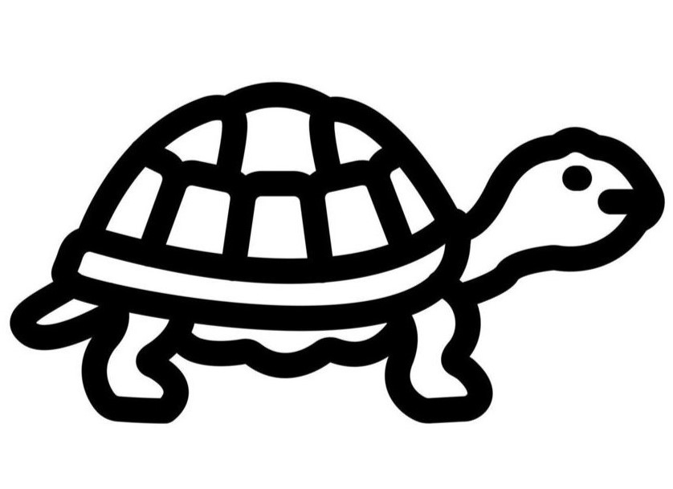

<body>
<figure class="image-left" style= "padding-top: 35px" >
    
    <figcaption style="padding-top:20px;">
        <h4 style="font-weight: bold;">tortoise-mail: </h4>        
        
Tyler Marghetis 

        
University of California, Merced

        
5200 North Lake Rd.

        
Merced, CA 95343

        
United States of America

    </figcaption>
</figure>

<figure class="image-left" style="padding-top: 35px; padding-left: 360px">
    
 <figcaption style="padding-left: 40px; padding-top: 20px;">
        <h4 style="font-weight: bold;">hare-mail: </h4>        
        
tyler.marghetis@gmail.com 

    </figcaption>
</figure>
</body>