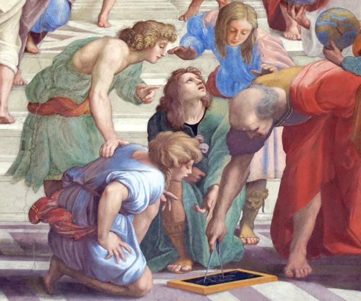
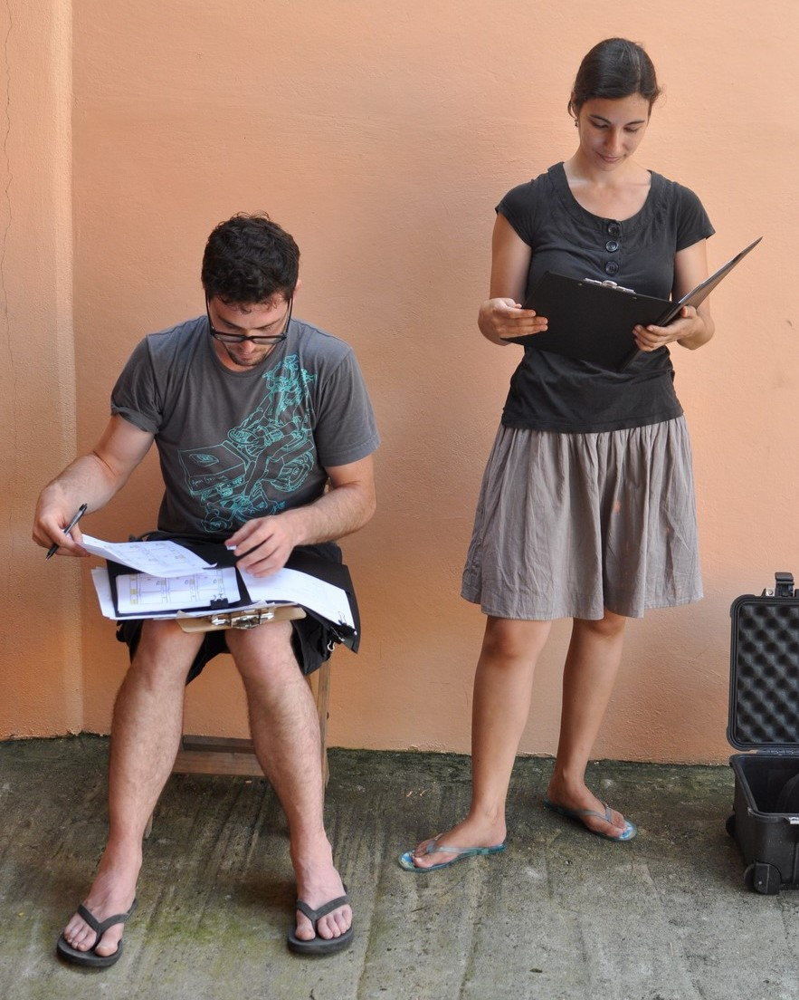

<body>

<h1 style="text-align: center; margin-top: 5px; margin-bottom: 16.5px;">Welcome!</h1>

<figure class="image-right" style="padding-top: 10px;">
    
    <figcaption>
        
The not-yet-cleverly-named "Marghetis Lab" is led by Prof. Tyler Marghetis,
based in the Department of [Cognitive & Information Sciences](https://cogsci.ucmerced.edu) at the [University of California, Merced](https://www.ucmerced.edu/)

        
We study cognition and communication as they occur within interconnected, multiscale, complex systems — brains, bodies, small groups, and large sociocultural systems.

    </figcaption>
</figure>

<figure class="image-left" style="padding-top: 10px;">
    
    <figcaption>
        
Our tools are many: behavioral experiments, in the lab and online; observation and analysis of real-world behavior; neuroscience methods like EEG; historical case studies; and computational modeling. 

        
A major focus is investigating how thought and behavior can get stuck in stable patterns ('regimes') but also change suddenly ('ruptures'). Examples include "aha!" moments in mathematics, paradigm shifts in science, romantic breakups, cultural revolutions, creative breakthroughs in the arts, and improvisation by musicians.

        
In other words, we study the lulls and leaps of human imagination.

    </figcaption>
</figure>

  
Our lab celebrates curiosity, encourages collaboration, and cultivates both intellectual playfulness and rigor. And we work to create an environment that is inclusive and anti-racist. [More info here](https://marghetislab.github.io/resources.html).

</body>