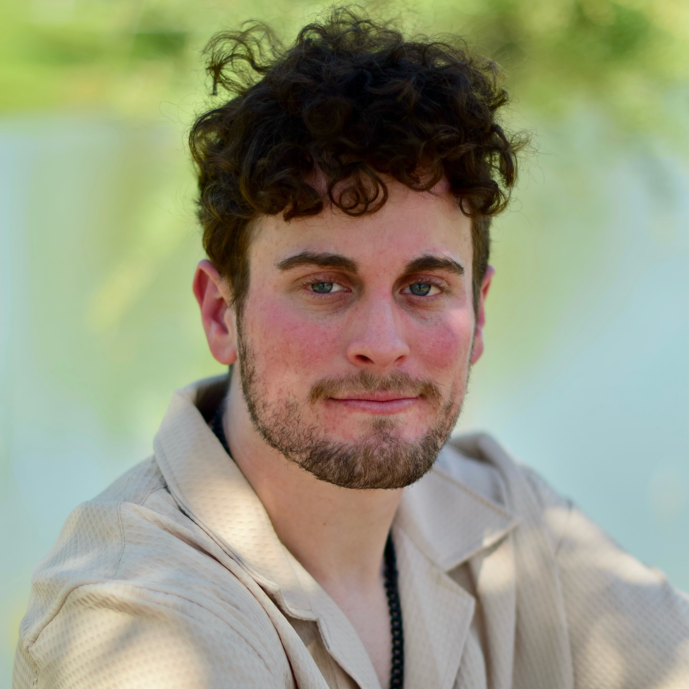

# Principal Investigator

<figure class="image-left" style="padding-top: 10px;">
    
    <figcaption>
        <h2>[Dr. Tyler Marghetis](https://www.tylermarghetis.com/)</h2>
        
I'm an Assistant Professor of [Cognitive & Information Sciences](https://cogsci.ucmerced.edu) at the [University of California, Merced](https://www.ucmerced.edu/). I am also an [Omidyar Complexity Fellow](https://www.santafe.edu/people/profile/tyler-marghetis) at the [Santa Fe Institute](https://www.santafe.edu/).
After completing my PhD in [cognitive science](https://cogsci.ucsd.edu/) at the University of California, San Diego (with [Rafael Núñez](https://cogsci.ucsd.edu/people/faculty/rafael-nunez.html)), I did postdoctoral research at Indiana University, Bloomington, mentored by [Robert Goldstone](https://psych.indiana.edu/directory/faculty/goldstone-robert.html) and [David Landy](https://davidlandy.net/).

</figure>

<figure class="image-right">
    
    <figcaption style="padding-top:60px" style="padding-left:0px">
        
Before I found my calling as a scientist, I lived in Canada,
where I was a child detective, a professional magician, 
and a national team wrestler and alternate for the 2008 Olympics.

(This image illustrates how, in sport as in science, using your head can save the day.)

When I'm not tracing the limits of human imagination, you'll find me biking around town, cooking feasts for chosen family, and working toward a more just society. (Though perhaps not all at once.)

    </figcaption>
</figure>

# Graduate Students
<figure class="image-left" style="padding-top: 10px;">
    
    <figcaption>
        <h2>Chanuwas Aswamenakul</h2>
        
I’m a PhD student in the Marghetis lab and the Smaldino lab. I study politics as a multi-level complex collective decision-making system that can be shaped by formal institutions, culture, and interpersonal dynamics and how different political systems affect economic outcome and human behaviors.

        
In my free time, I enjoy gaming, watching anime, cooking, sightseeing, and photography.

    </figcaption>
</figure>

<figure class="image-left" style="padding-top: 10px;">
    
    <figcaption>
        <h2>Leo Niehorster-Cook</h2>
        
I'm a PhD student in the Marghetis Lab, starting Fall of 2022. I study how interactions between individual minds give rise to large-scale social phenomena such as collective action, group conflict, and communication systems, with a focus on formal modeling techniques.

        
Outside the lab, I'm a community organizer and an avid fan of science fiction.

    </figcaption>
</figure>

<figure class="image-left" style="padding-top: 20px;">
    
    <figcaption>
        <h2>Soran Malaie</h2>
        
I am a second-year PhD student in the Cognitive Science Department at UC Merced. My research focuses on understanding creativity as a form of spatial foraging behavior, situated within the context of embodied cognition. My work draws inspiration from Merleau-Ponty's phenomenology and James Gibson’s Ecological Psychology.

        
Outside the lab, my Kurdish heritage has led me to closely follow political conflicts, notably those in the Middle East, where I fervently support marginalized minority groups in their pursuit of justice and empowerment.

    </figcaption>
</figure>

<figure class="image-left" style="padding-top: 20px;">
    
    <figcaption>
        <h2>Shervin Nosrati</h2>
        
I am a first year PhD student in the Marghetis Lab. I research metaphor, gesture, and all things space and time. I am particularly interested in how we use our understanding of space to structure abstract conceptualization.

        
In my spare time, I am making copious amounts of pasta and watching old samurai movies with my cat Data.

    </figcaption>
</figure>

<figure class="image-left" style="padding-top: 20px;">
    
    <figcaption>
        <h2>Benjamin Robbins</h2>
        
Hi everyone! I’m a current researcher in the Marghetis Lab working on the creation of a paper examining the ways that disability and difference can lead to creative breakthroughs through conceptual analysis and a literature review. My research interests vary, though the main focus of my research include Mental Health, Emotion, and Judgement and its interactions with Decision-Making. These interests have been passions of mine for as long as I can remember, and I’m always looking to learn as much as I can on the subject.

        
Outside of the lab, other interests and hobbies of mine include baseball, music, physical exercise, and cooking!

    </figcaption>
</figure>

# Research Staff

<figure class="image-left" style="padding-top: 10px;">
    
    <figcaption>
        <h2>Alyssa Ortega</h2>
        
I am the full time joint manager of Marghetis and [LInC lab](https://linclab0.github.io/) at the University of California, Merced,  where I recently graduated with a B.A. in Psychology & Cognitive Science. While my primary interest lies in exploring the impact of gesture as a promoter of learning and discovery, my role as a lab manager has given me the opportunity to be involved in a wide array of projects. I currently utilize a variety of methods such as behavioral experimentation, EEG, and naturalistic observation. 

        
Recently, my free time has been dedicated to working on graduate school applications but I also enjoy going for runs to decompress after a long day. 

    </figcaption>
</figure>

# Research Assistants

  
  Suma Vintha

  
  Saloni Naik
  

  
  Kanly Thao
  

  
  Kaushik Ram

  
  Leslie Flores

  
  Harini Muralidharan

  
  Julia Ton
  

  
  Isabella Dohnke
  
  

  
  Axel Jacobo
  
  

# Alumni

<h3>Graduate </h3>
Dr. Shadab Tabatabaeian
<h3>Undergraduate </h3>
Willow Jee 
Ricardo Alfonso 
Sandra Chacon 
Maya Changaran Kumarath 